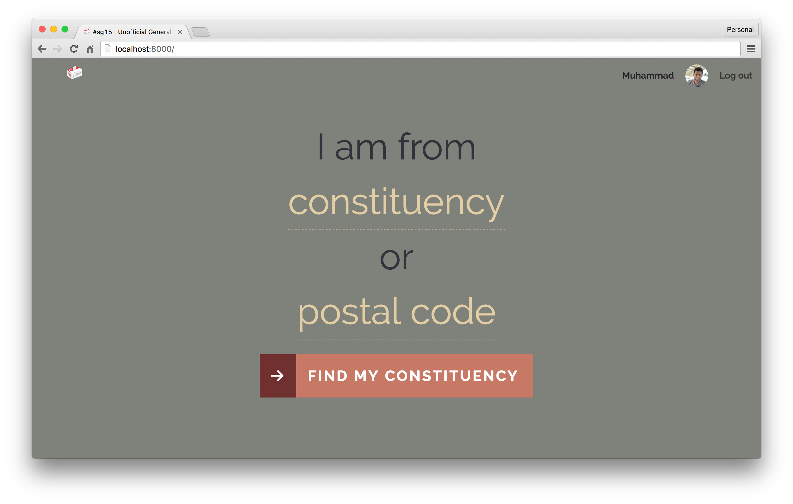
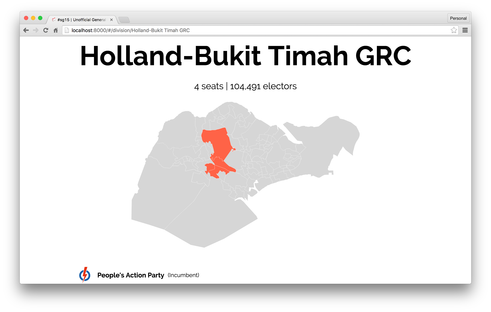
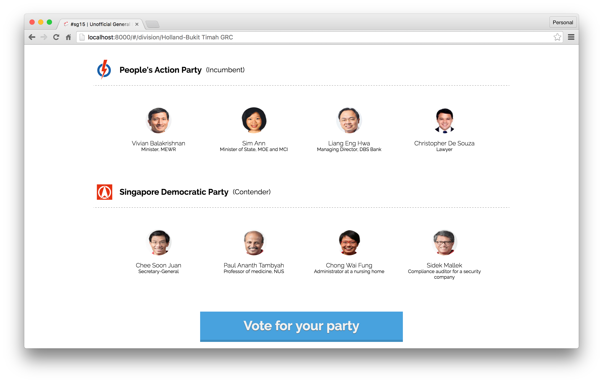
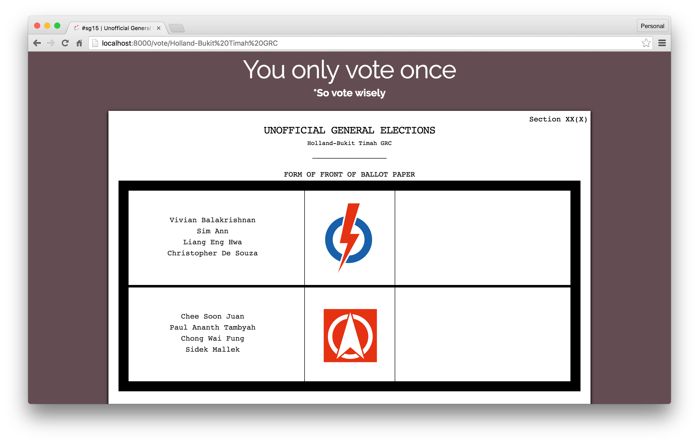
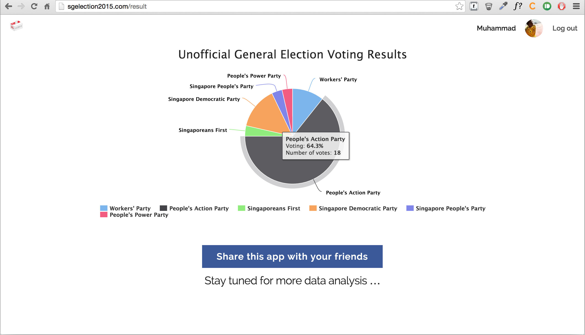

GE2015 - Unofficial General Election App
======


### Introduction

This app was developed and released during the 2015 General Elections in Singapore. The main purpose of the app was to allow users to have an insight into the politcal leanings of their friends.

Users can search for the political parties that are contesting in their constituency by either searching by constituency or postal code. Users can then vote for their party. *VOTING IDENTITY IS KEPT A SECRET.* After voting, users can view political leanings of their friends in the form of a pie chart.

### Installation

Install node packages:
```
$ npm install
```

Make a copy of `facebook_config.sample.js`, rename it to `facebook_config.js` and fill it up with Facebook's API details. Likewise, make a copy of `mongo_config.sample.js`, rename it to `mongo_config.js` and fill it up MongoDB's url.

Populate the database:
```
$ npm run populate
```

To run the application in development, run both of these commands simultaneously on separate terminal windows:
```
$ node_modules/webpack/bin/webpack.js --config config/webpack.config.js --watch
```
```
$ npm run start
```

### How it works

##### Search for your constituency



##### Get information of any constituency





##### Vote your favourite party



##### Learn about your friends' political affiliations

